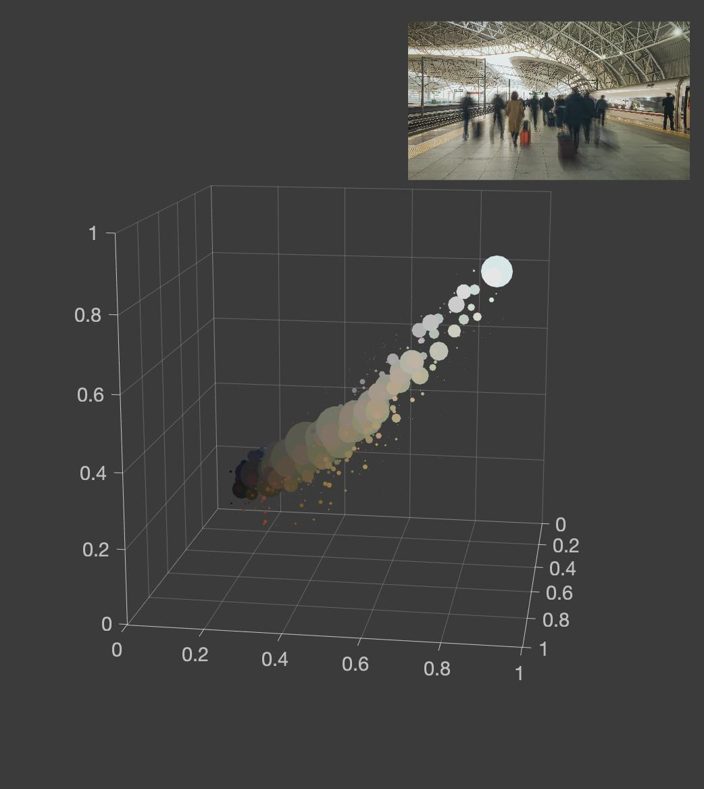

# Color space tools

This is a collection of tools used for color space conversion & visualization.
Only matlab codes now. I'll write some python codes in the future.

## Examples

Plot RGB bubble chart for an image.

~~~matlab
figure(1); clf;
set(gcf, 'position', [800, 200, 800, 900]);

axes('position', [0, 0, 1, 1]);
plot_colorspace_bubble(img, 'Background', [1, 1, 1] * 0.23);
set(gca, 'CameraViewAngle', 23, 'CameraPosition', [5.0, 1.2, 1.6]);

axes('position', [0.58, 0.76, 0.4, 0.225]);
imshow(img);
~~~

